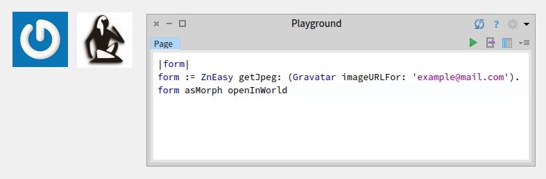

# Pharo-Gravatar
A simple Pharo wrapper for the Gravatar API

[](https://github.com/astares/Pharo-Gravatar/actions?query=workflow%3AUnit%20Tests)
[](https://codecov.io/gh/astares/Pharo-Gravatar/branch/main)


[](https://pharo.org/download)
[](https://pharo.org/download)
[](https://pharo.org/download)

## Quick start

```Smalltalk
Metacello new 
    repository: 'github://astares/Pharo-Gravatar:main/src';
    baseline: 'Gravatar';
    load
```

## Screnshot

### Windows


## Use in your own application

### Retrieving the image URL
Usually you display a Gravatar image within a web application. If you generate the HTML you will add an URL for the image. To get one you can use:

```Smalltalk
Gravatar imageURLFor: 'example@mail.com'
```

If you require a different size just evaluate:

```Smalltalk
Gravatar imageURLFor: 'example@mail.com' size: 32.
```

Retrieving and displaying an image
If you need the real image you can use Pharos Zinc components suite to get the image form over HTTP and open it on your Pharo desk:

```Smalltalk
|form|
form := ZnEasy getJpeg: (Gravatar imageURLFor: 'example@mail.com').
form asMorph openInWorld
```

## Internals

Gravatar is based on MD5 hashing an email address. To get the hashing just evaluate:

```Smalltalk
Gravatar hash: 'example@mail.com' 
```

### Packages

Gravatar-Core - package with the core, contains anything you need in an own app
Gravatar-Core-Tests - package with the SUnit tests

### Testing
The package comes with unit tests tests in the package Gravatar-Core-Tests. Just use the SUnit TestRunner to run them.
